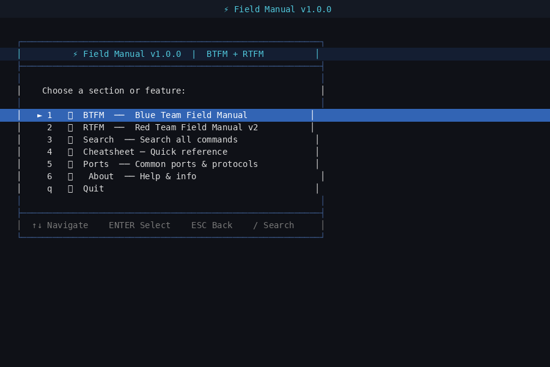
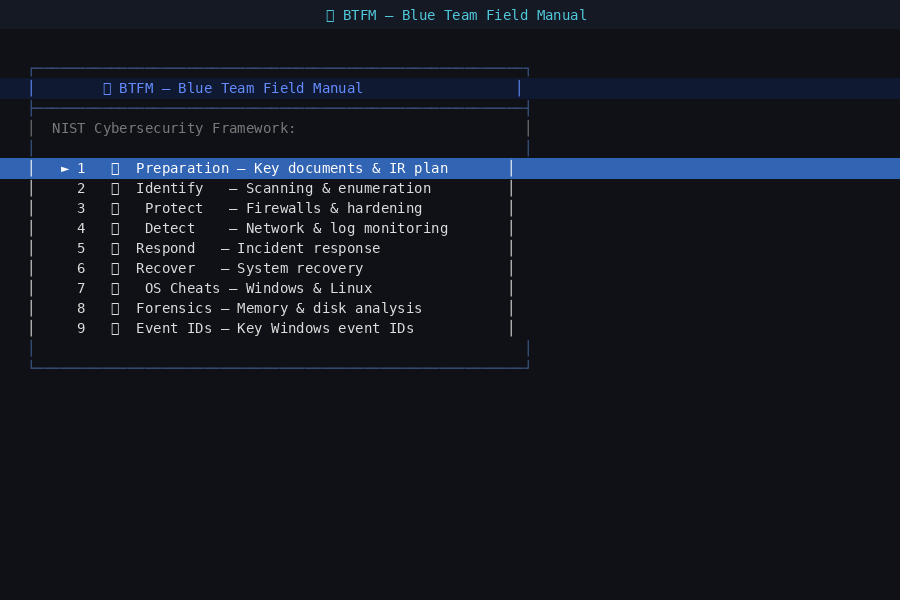
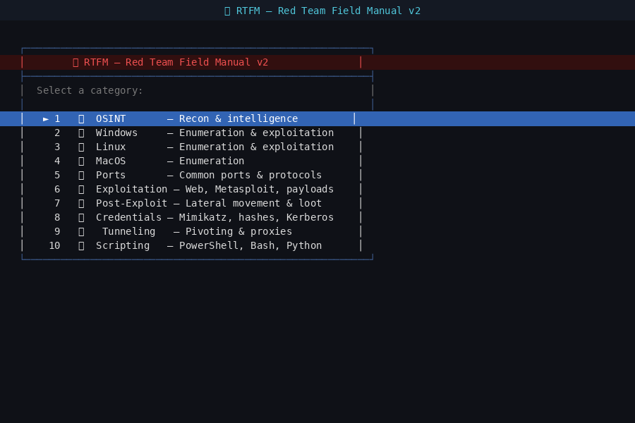
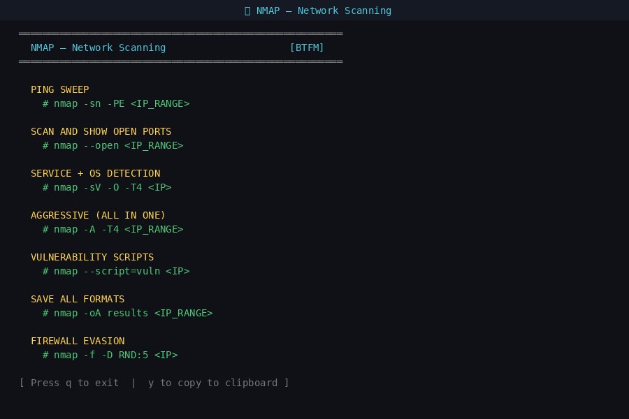
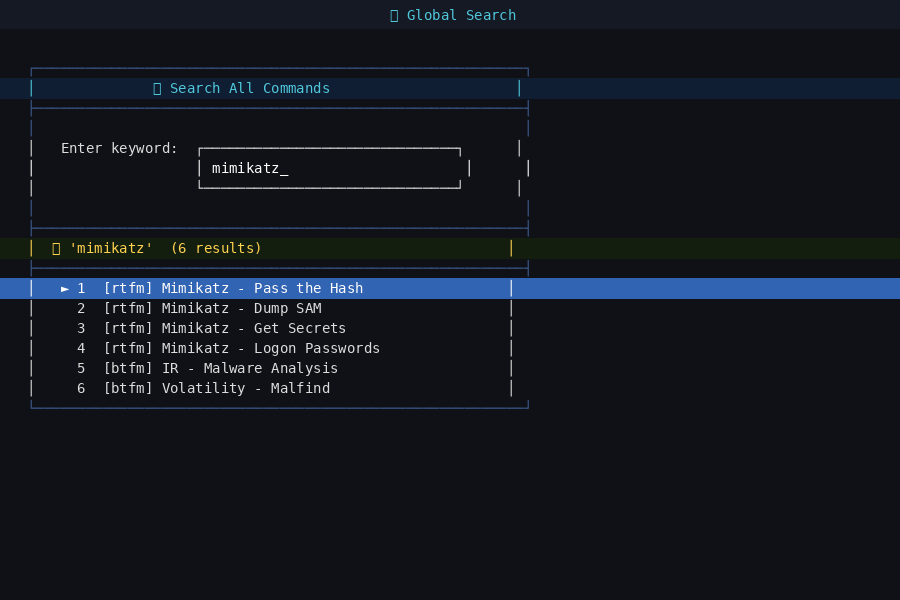
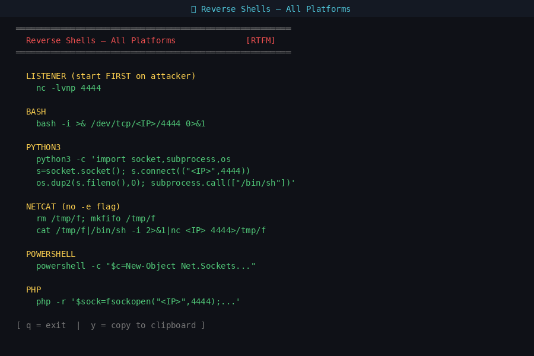

<div align="center">

```
██████╗ ████████╗███████╗███╗   ███╗
██╔══██╗╚══██╔══╝██╔════╝████╗ ████║
██████╔╝   ██║   █████╗  ██╔████╔██║
██╔══██╗   ██║   ██╔══╝  ██║╚██╔╝██║
██║  ██║   ██║   ██║     ██║ ╚═╝ ██║
╚═╝  ╚═╝   ╚═╝   ╚═╝     ╚═╝     ╚═╝
```

# ⚡ Field Manual TUI

**Red & Blue Team Field Manual — Interactive Terminal Reference**

[](https://github.com/SiteQ8/field-manual/actions)
[](LICENSE)
[](https://www.gnu.org/software/bash/)
[](https://github.com/SiteQ8/field-manual)
[](https://github.com/SiteQ8/field-manual)

*A fully interactive bash TUI built from the **SiteQ8 Blue Team Tools** and **SiteQ8 Red Team Tools** — every command at your fingertips, offline, zero dependencies beyond bash + dialog.*

</div>

---

## 📸 Screenshots

<div align="center">

| Main Menu | SiteQ8 Blue Team |
|:---------:|:----------------:|
|  |  |

| SiteQ8 Red Team | NMAP Reference |
|:---------------:|:--------------:|
|  |  |

| Global Search | Reverse Shells |
|:-------------:|:--------------:|
|  |  |

</div>

---

## 🚀 Quick Install

```bash
git clone https://github.com/SiteQ8/field-manual.git
cd field-manual
chmod +x install.sh
./install.sh
field-manual
```

Or run directly without installing:
```bash
git clone https://github.com/SiteQ8/field-manual.git
cd field-manual
bash field-manual.sh
```

---

## 📋 Requirements

| Dependency | Install |
|-----------|---------|
| `bash` ≥ 4.0 | Pre-installed on most systems |
| `dialog` | `sudo apt install dialog` |

**Optional** (clipboard copy support):

| Tool | System |
|------|--------|
| `xclip` | Linux (X11) |
| `xsel` | Linux (X11 alt) |
| `pbcopy` | macOS |

---

## 📚 What's Inside

### 🔵 SiteQ8 Blue Team Tools

Based on SiteQ8 Blue Team Tools by **Alan White & Ben Clark**

| Section | Coverage |
|---------|----------|
| **📋 Preparation** | Documentation checklist, NIST CSF, IR planning |
| **🔎 Identify** | NMAP, Nessus, OpenVAS, Windows/Linux discovery, AD enum, hashing |
| **🛡️ Protect** | IPTables, UFW, Windows Firewall, AppLocker, IPSEC, registry hardening, honeypots |
| **👁️ Detect** | TCPDump, TShark, Snort, Windows/Linux log auditing, auditd, SSL checks |
| **🚨 Respond** | IR triage (Windows/Linux), network isolation, evidence collection, malware analysis |
| **🏥 Recover** | SFC, DISM, boot repair, Linux fsck, service restoration |
| **🖥️ OS Cheats** | Windows cmd, PowerShell, Linux commands, networking, encoding |
| **🧬 Forensics** | Volatility memory analysis, disk imaging, PCAP analysis, file carving |
| **🔑 Event IDs** | 50+ key Windows Event IDs with descriptions and logon type codes |

### 🔴 SiteQ8 Red Team Tools

Based on SiteQ8 Red Team Tools by **Ben Clark & Nick Downer**

| Section | Coverage |
|---------|----------|
| **🌐 OSINT** | theHarvester, recon-ng, Maltego, Google dorks, subdomain enum, Shodan |
| **🪟 Windows** | Situational awareness, AD enum, persistence, PowerShell/Batch scripting, remote exec |
| **🐧 Linux** | System enum, persistence (cron/rc.local/service), privesc, SSH/IPTables/tools |
| **🍎 MacOS** | System enum, plist enumeration, user management, network config |
| **🌍 Ports** | Top 50 common ports, healthcare, SCADA/ICS, IPv4/IPv6, TTL fingerprinting |
| **💣 Exploitation** | Metasploit, MSFVenom, SQLMap, web tools (gobuster/nikto/wpscan), brute force |
| **🎯 Post-Exploit** | Looting (Windows/Linux), lateral movement, credential hunting |
| **🔑 Credentials** | Mimikatz, LSASS dump, Pass-the-Hash, Kerberoasting, AS-REP roasting |
| **🕳️ Tunneling** | SSH tunnels, ProxyChains, Chisel, Ligolo-ng, Socat, SSHuttle |
| **📜 Scripting** | PowerShell, Batch, Python, Bash, Scapy one-liners |
| **💡 Tips** | Reverse shells (10 languages), TTY upgrade, exfiltration, LOLBins |

### ✨ Features

- 🔍 **Global Search** — search across all Blue + Red Team commands by keyword
- 📋 **Clipboard Copy** — press `y` to copy any page to clipboard
- ⚡ **Quick Reference** — cheatsheet mode for fastest access
- 🌐 **Ports Database** — common, healthcare, SCADA, IPv4, IPv6, TTL
- 🔌 **Offline** — works completely offline, no internet required
- 🚀 **Fast** — pure bash + dialog, launches instantly
- 📦 **Zero config** — works out of the box after install

---

## 🗂️ Project Structure

```
field-manual/
├── field-manual.sh          # Main entry point
├── install.sh               # Installer script
├── LICENSE                  # MIT License
├── README.md
├── .gitignore
├── lib/
│   ├── colors.sh            # ANSI color constants
│   ├── ui.sh                # dialog wrappers, show_page()
│   └── search.sh            # Global search engine
├── modules/
│   ├── blue/
│   │   ├── menu.sh          # Blue Team main menu
│   │   ├── preparation.sh
│   │   ├── identify.sh      # NMAP, Nessus, OpenVAS, AD enum
│   │   ├── protect.sh       # IPTables, UFW, Windows FW, AppLocker
│   │   ├── detect.sh        # TCPDump, TShark, Snort, auditd
│   │   ├── respond.sh       # IR triage, isolation, evidence
│   │   ├── recover.sh       # SFC, DISM, fsck, restore
│   │   ├── os_cheats.sh     # Windows + Linux commands
│   │   ├── forensics.sh     # Volatility, disk, PCAP, carving
│   │   ├── event_ids.sh     # Windows Event ID reference
│   │   ├── quick_ref.sh     # Cheatsheet mode
│   │   └── blue.dat         # Searchable command index
│   └── red/
│       ├── menu.sh          # Red Team main menu
│       ├── osint.sh         # OSINT, Google dorks, subdomains
│       ├── windows.sh       # Windows enum, persistence, remote exec
│       ├── linux.sh         # Linux enum, persistence, privesc
│       ├── macos.sh         # MacOS enum
│       ├── ports.sh         # Ports reference, IPv4, IPv6, TTL
│       ├── exploit.sh       # Metasploit, SQLMap, brute force
│       ├── postex.sh        # Post-exploitation, lateral movement
│       ├── creds.sh         # Mimikatz, LSASS, PTH, Kerberoast
│       ├── tunneling.sh     # SSH, Chisel, Ligolo, Socat, SSHuttle
│       ├── scripting.sh     # PowerShell, Batch, Python, Scapy
│       ├── tips.sh          # Reverse shells, TTY upgrade, exfil
│       └── red.dat         # Searchable command index
├── screenshots/             # Terminal screenshots for README
│   ├── 01_main_menu.png
│   ├── 02_blue_menu.png
│   ├── 03_red_menu.png
│   ├── 04_nmap_content.png
│   ├── 05_search.png
│   └── 06_revshells.png
└── .github/
    └── workflows/
        └── ci.yml           # ShellCheck + syntax + structure tests
```

---

## ⌨️ Navigation

| Key | Action |
|-----|--------|
| `↑` / `↓` | Navigate menu |
| `Enter` | Select item |
| `ESC` | Go back |
| `q` | Quit / close page |
| `y` | Copy page to clipboard |
| `Tab` | Switch between buttons |
| `1-9` | Jump to item directly |

---

## 🔍 Search Usage

```bash
field-manual
# → Select option 3 (Search)
# → Type: mimikatz
# → View results from both Blue and Red Team
# → Press y to copy to clipboard
```

Or use shell grep for quick lookup:
```bash
grep -ri 'sqlmap' ~/.local/share/field-manual/modules/
```

---

## 🔧 Uninstall

```bash
./install.sh uninstall
```

---

## ⚖️ Legal & Disclaimer

> **FOR EDUCATIONAL AND AUTHORIZED TESTING USE ONLY.**
>
> This tool provides a reference interface for security professionals performing authorized penetration testing and defensive security operations. Users are responsible for ensuring they have proper authorization before using any techniques referenced herein.
>
> The author assumes no liability for misuse of this software.

Content sourced from:

---

## 👤 Author

**Ali AlEnezi**
- GitHub: [@SiteQ8](https://github.com/SiteQ8)
- Email: [Site@hotmail.com](mailto:Site@hotmail.com)

---

## 🤝 Contributing

Pull requests welcome! Please:
1. Fork the repo
2. Create a feature branch: `git checkout -b feature/new-module`
3. Ensure ShellCheck passes: `shellcheck modules/**/*.sh`
4. Submit a PR with a clear description

---

## ⭐ Star History

If this tool saves you time during an engagement or helps you learn, please consider starring the repo!

---

<div align="center">

Made with ❤️ by Ali AlEnezi | [@SiteQ8](https://github.com/SiteQ8)

*Stay safe. Stay legal. 🛡️*

</div>
